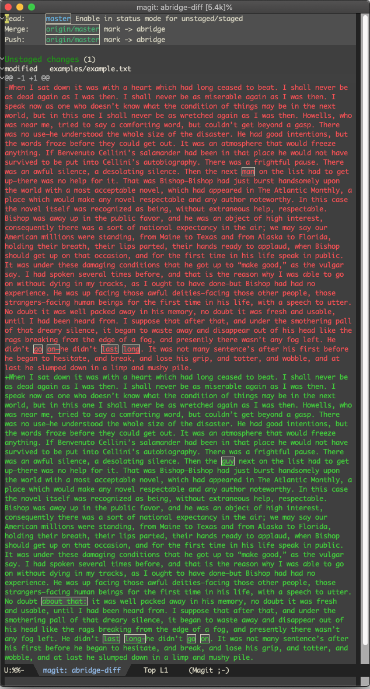
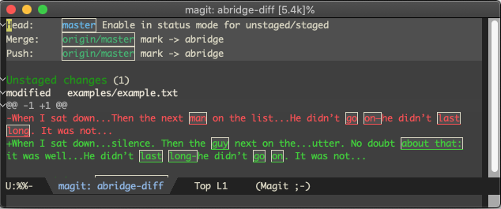
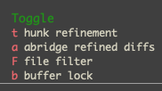

# abridge-diff
A simple Emacs package for _abridging_ refined diff hunks (for example in [magit](https://github.com/magit/magit)).  Why abridge a diff hunk?  Most diffs are line based.  If you are working on files with very long lines, for example LaTeX files, or text files with full paragraphs per line (often using `visual-line-mode`), line-based diffs can be very challenging to read, even with "hunk refining" enabled (highlighting the words which changed). 

## In pictures:

#### Before
For long, multi-sentence paragraphs on a single line, showing a few changes produces lots of useless context:


#### After
Using `abridge-diff`, only the refined changes and a bit of surrounding context are shown.  Much cleaner:


## Installation:

`abridge-diff` is available on Melpa.  To configure, either `require` the old fashioned way (after `magit`, if you intend to use them together), or, equivalently, with `use-package`:

```elisp
(use-package abridge-diff
  :after magit ;; optional, if you'd like to use with magit
  :init (abridge-diff-mode 1))
```

You can disable `abridge-diff` with `C-- M-x abridge-diff-mode`.

## Usage:

Once installed and enabled, `abridge-diff` will immediately start abridging all _refined_ diff hunks. You can enable and disable _showing_ the abridged version using `abridge-diff-toggle-hiding`.  Hunks are shown as abridged by default.

## Magit tips:

`abridge-diff` automatically configures itself to work with [magit](https://github.com/magit/magit). *Important*: you must enable hunk refining for this to do anything in magit.  To toggle abridged text visibility, simply invoke magit's `Diff (change)` command (default `D`), and use command `a`: 



This works best with `magit-diff-refine-hunk` set to `'all` (so that all hunks in a given diff have their refined differences computed in one pass).  If you are working with long lines, `abridge-diff` has the most impact with limited or no surrounding-line context (`-U0`, just hit `-` repeatedly).  Applying abridged diff hunks should work as normal.  

## Settings:

You can customize settings with these variables; just `M-x customize-group abridge-diff`:

- **abridge-diff-word-buffer**:  Number of words to preserve around refined regions.
- **abridge-diff-first-words-preserve**: Keep at least this many words visible at the beginning of an abridged line with refined diffs.
- **abridge-diff-invisible-min**: Minimum region length (in characters) between refined areas that can be made invisible.  Smaller regions are left visible. 
- **abridge-diff-no-change-line-words**: Number of words to keep at the beginning of a line without any refined diffs.
- **abridge-diff-exclude-files-matching**: A list of regexps matching files to exclude from diff abridging in magit, e.g. '("\\.py$" "foo.*bar"). Diffs of other files are still abridged. 

## How this works:

This works by adding a post-processing step after `diff-refine-hunk` (which itself uses `smerge-refine-regions`).  This protects all refined differences and a configurable amount of context around them, and computes regions to hide, marking them with a special `'invisibility` text property.  Note that the abridged text is still _there_, but indicated by an ellipsis (…), so toggling hiding simply reveals it.
